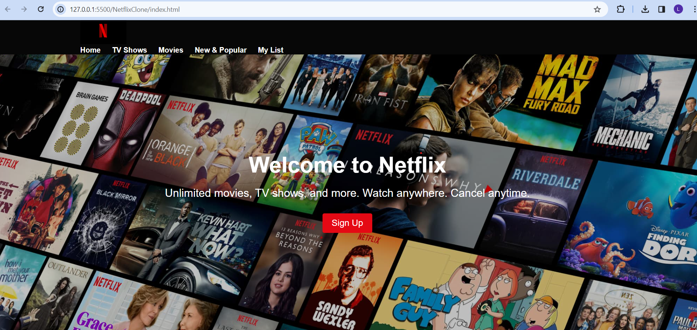

# Bharat Intern Netflix Clone

A sleek and responsive front-end Netflix clone created as part of the Bharat Intern program. This project focuses on modern UI design using HTML and CSS to replicate the Netflix landing page and provide a visually engaging user experience.

## Project Overview

This project is a static front-end replica of the official Netflix homepage, designed to practice layout structuring, visual design principles, and responsive styling. While it does not include backend functionality, it serves as a strong foundation for further feature additions such as user authentication, movie listings, and streaming integration.

## Features

- Clean and pixel-perfect Netflix-style UI
- Responsive layout compatible with desktops, tablets, and mobile devices
- Interactive hover effects and layout components
- Organized, readable, and scalable CSS structure

## Preview



> 📌 *Note: This is a static clone built purely with HTML and CSS. No dynamic data or video streaming is included.*

## Technologies Used

- HTML5 – Semantic structure and layout
- CSS3 – Styling, flexbox, grid, and media queries

## Getting Started

To run this project locally:

1. **Clone the repository**
   ```bash
   git clone https://github.com/Lakshya4781/Bharat_Intern_Netflix.git
   cd Bharat_Intern_Netflix
2.Open index.html in your browser
No server setup is required.

Project Structure
cpp
Copy
Edit
Bharat_Intern_Netflix/
├── index.html       // Main landing page
├── styles.css       // All custom styles
├── Preview.png      // UI screenshot
└── README.md        // Project documentation
